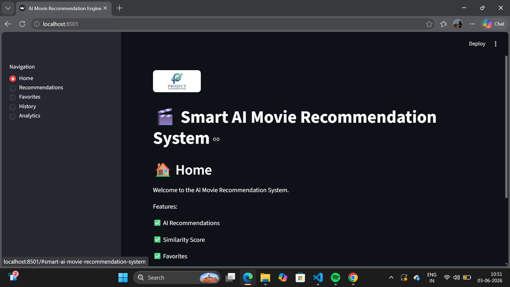
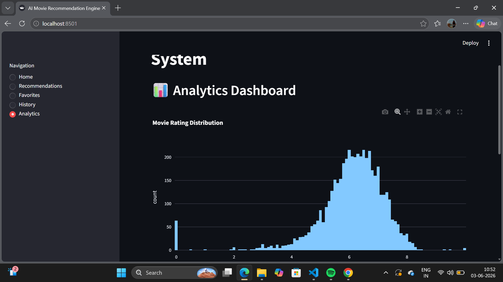
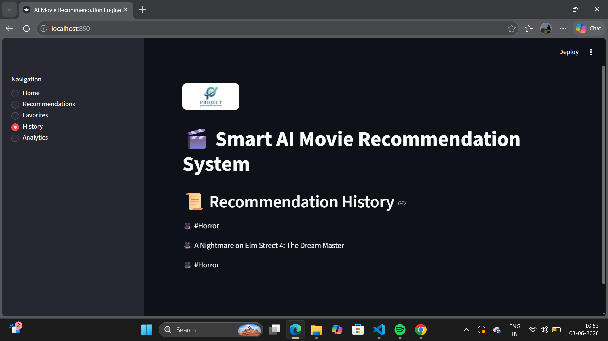

# 🎬 AI Movie Recommendation System

## Overview

AI Movie Recommendation System is a content-based recommendation engine built using Python, Streamlit, Pandas, and Scikit-Learn. The system analyzes movie genres, keywords, and overviews to recommend similar movies using Natural Language Processing (NLP) and Cosine Similarity.

This project demonstrates the fundamentals of Artificial Intelligence recommendation systems and personalized content suggestions.

---

## Features

* 🎯 AI-Powered Movie Recommendations
* 🔍 Movie Search Functionality
* 📊 Similarity Score Calculation
* ⭐ Rating-Based Filtering
* 🔥 Popularity-Based Ranking
* ❤️ Favorites Management
* 📜 Recommendation History Tracking
* 📈 Analytics Dashboard
* 🎨 Interactive Streamlit User Interface

---

## Technologies Used

* Python
* Streamlit
* Pandas
* NumPy
* Scikit-Learn
* Plotly

---

## Dataset

The project uses the TMDB 5000 Movies Dataset from Kaggle.

Files Used:

* tmdb_5000_movies.csv
* tmdb_5000_credits.csv

Dataset includes:

* Movie Titles
* Genres
* Keywords
* Overview
* Ratings
* Popularity Scores

---

## Recommendation Technique

The recommendation engine uses:

1. Content-Based Filtering
2. TF-IDF Vectorization
3. Cosine Similarity

The system compares movie descriptions, genres, and keywords to identify similar movies and generate personalized recommendations.

---

## Project Structure

AI_RECOMMENDATION_SYSTEM

├── assets
│   └── logo.png

├── data
│   ├── tmdb_5000_movies.csv
│   └── tmdb_5000_credits.csv

├── user_data
│   ├── favorites.json
│   ├── history.json
│   └── user.json

├── analytics.py
├── auth.py
├── recommendation_engine.py
├── app.py
├── requirements.txt
└── README.md

---

## Installation

Clone the repository:

```bash
git clone <repository-url>
```

Navigate to the project folder:

```bash
cd AI_RECOMMENDATION_SYSTEM
```

Install dependencies:

```bash
pip install -r requirements.txt
```

Run the application:

```bash
streamlit run app.py
```

---

## How It Works

1. User selects a movie.
2. The recommendation engine processes movie metadata.
3. TF-IDF converts text into numerical vectors.
4. Cosine Similarity finds related movies.
5. Top matching movies are displayed with:

   * Similarity Score
   * Rating
   * Popularity

---

## Future Enhancements

* User Authentication
* Movie Posters via TMDB API
* Hybrid Recommendation System
* Collaborative Filtering
* Watchlist Management
* Dark Mode Support
* Cloud Deployment

---

## Learning Outcomes

Through this project, the following concepts are demonstrated:

* Artificial Intelligence Fundamentals
* Recommendation Systems
* Natural Language Processing
* Machine Learning Similarity Models
* Data Analysis
* Streamlit Application Development

---
## 📸 Project Screenshots

### 🏠 Home Page



---

### 🎯 Movie Recommendations


---

### 📊 Analytics Dashboard



---

### 📊 History Dashboard



---
## Author

**Vanshika Kaushik**

Artificial Intelligence Enthusiast | Aspiring AI Engineer

---

## License

This project is developed for educational and portfolio purposes.